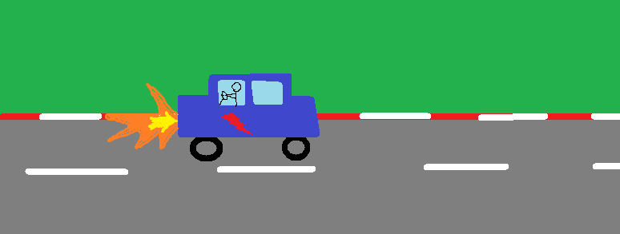

## Optimal Control

This repository contains files, that implements optimal control problems.
Optimal control describes the following problem: For a function 
$f: \mathbb{R}^n \times \mathbb{R}^m \rightarrow \mathbb{R}^n$ and some 
called _control_ $\alpha:[0,\infty) \rightarrow \mathbb{R}^m$ we consider
an ODE:
$$\begin{cases}
\dot{x}(t) = f(x(t),\alpha(t)), \\
x(0) = x_0
\end{cases}
$$
We want to find a control $\alpha$ in some set $\mathcal{A} \subset
\{\alpha:[0,\infty) \rightarrow \mathbb{R}^m | \ \alpha \text{ is measurable}
\}$ (often, $\mathcal{A}$ is just a restriction of the images of the $\alpha$),
such that, for some cost functions 
$r:\mathbb{R}^n \times \mathbb{R}^m \rightarrow \mathbb{R}$ and 
$g:\mathbb{R}^n \rightarrow \mathbb{R}$, we minimize the functional $P$, defined
as:
$$P[\alpha] = \int_0^T r(x_\alpha(t), \alpha(t)) dt + g(x(T))$$
($x_\alpha$ is the solution of the ODE, $T$ is allowed to be infinite). An
introduction to the theory of optimal control problems which also contains the
examples in this repository can be found here:
https://math.berkeley.edu/~evans/control.course.pdf \
The numerical methods implemented are reviewed here: \
https://epub.uni-bayreuth.de/id/eprint/2001/1/Gruene_num_meth_nonlin_optimal_control_2013.pdf

### Rocket Car



This example is analytically solvable, but it's a good starting point to get an intuition for the situation,
especially if we have $\mathcal{A} = \{\alpha:(0, \infty) \rightarrow [-1,1] | \ \alpha \text{ is measurable} \}$.
In these cases the optimal solutions are so called _bang bang controls_, i.e. we have $\text{im}(\alpha_{\text{
opt}}) \subset \{-1,0,1\}$ (which often is correspondent to putting some switch on to the fullest).

In the example we have given a car on the real number line with a starting point and a starting velocity and
two rockets attached on both ends of the car. Both these rockets can be turned on and we can control the car
with them. This can be interpreted as an optimal control problem. The derivation of the analytical solution is
given in the script by Evans on p.10. It is implemented in ```rocket_car.py```.

### Moon Lander


In this example the height and velocity of a spacecraft close to the moon is given. Intuitively it is clear
that we have to fire the rockets at the bottom of the carrier at some point to guarantee a smooth landing.
We also want to minimise fuel use and the use of fuel affects the ODE governing our rocket (as the mass of it
decreases). The details of the problem are given in Evans script on p.55. We use a discretisation approach
to solve it. It is implemented in ```moon_lander.py```.

### Inventory Control
If we have a warehouse with items and a stream of demand for our goods, one might be interested in modeling,
how we can minimise ordering and storing costs, while still being able to meet demand. Such a model is described
in the Evans script on p.70. We solve it via a Hamilton-Jacobi-Bellman approach. The implementation can be found
in ```inventory_control.py```.

### Bee population
The reproductive strategy of a population of bees wants to maximise the number of queens at the end of a season.
As the population consists of workers and queens, the makeup of the bee society is a control system, which tries
to optimise this final number of queens. A mathematical description is given on p.6 of the Evans script. We 
implement and solve it by a Pontryagin maximum principle approach.